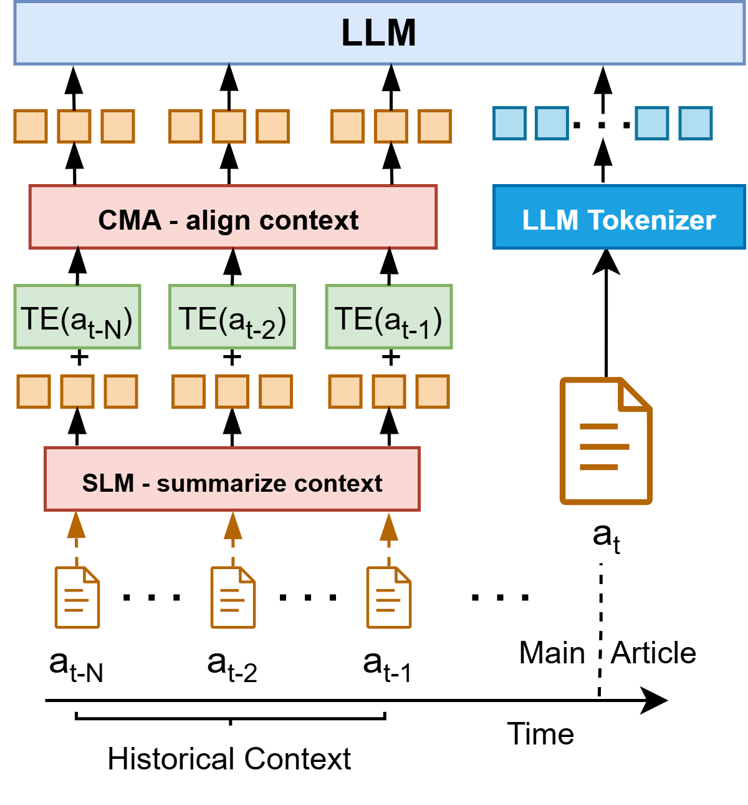
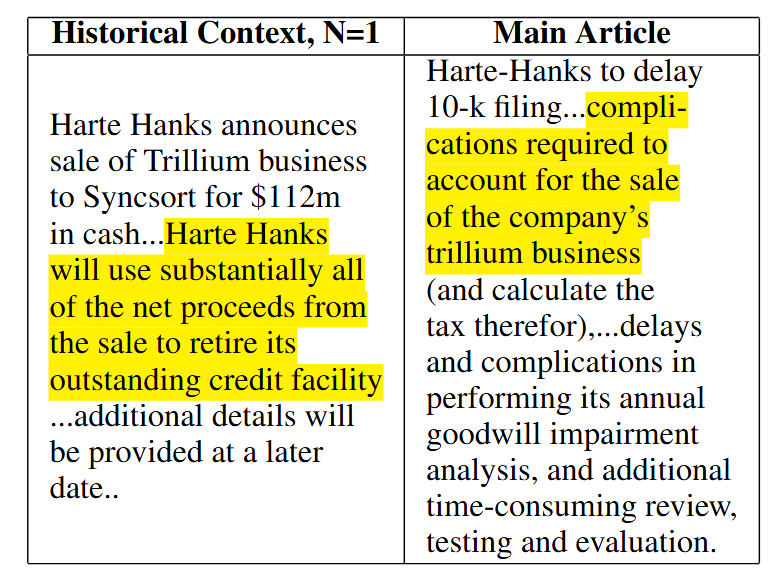

# Context-Aware Language Models for Forecasting Market Impact from Sequences of Financial News

## Introduction
This repository contains the main code used in our work: "Context-Aware Language Models for Forecasting Market Impact from Sequences of Financial News" by Ross Koval, Nicholas Andrews, and Xifeng Yan. 

If you find this work or code useful in your research, please consider citing our paper.

## Citation
If you find this work or code useful, please cite the paper:

```bibtex
@misc{koval2025contextawarelanguagemodelsforecasting,
  title={{Context-Aware Language Models for Forecasting Market Impact from Sequences of Financial News}},
  author={Koval, Ross and Andrews, Nicholas and Yan, Xifeng},
  year={2025},
  eprint={2509.12519},
  archivePrefix={arXiv},
  primaryClass={cs.CE},
  url={https://arxiv.org/abs/2509.12519}
}
```

## Abstract
Financial news plays a critical role in the information diffusion process in financial markets and is a known driver of stock prices. However, the information in each news article is not necessarily self-contained, often requiring a broader understanding of the historical news coverage for accurate interpretation. Further, identifying and incorporating the most relevant contextual information presents significant challenges. In this work, we explore the value of historical context in the ability of large language models to understand the market impact of financial news. We find that historical context provides a consistent and significant improvement in performance across methods and time horizons. To this end, we propose an efficient and effective contextualization method that allows the use of a large LM on the main article while using a small LM to encode the historical context into concise summary embeddings and aligning those embeddings into the large model's representation space. We explore the behavior of the model through multiple qualitative and quantitative interpretability tests and reveal insights into the value of contextualization. Finally, we demonstrate that the value of historical context in model predictions has real-world applications, translating to substantial improvements in simulated investment performance.

## Model Architecture

<p align="center">

</p>

*Figure 1: Overview of our contextualized news forecasting task and proposed Prefix Summary Context (PSC), which efficiently and effectively summarizes historical context with the Historical Context Summarizer (HCS) and aligns it in the latent space of a large LM with Cross-Model Alignment (CMA) and Context-Aware Language Modeling (CALM). The resulting PSC embeddings are prepended to the main article tokens, allowing the LLM to contextualize the main article with historical background.*

## Case Study 

<p align="center">

</p>

*Figure 2: Sample news that highlights the value of historical context in understanding the recent news article. Without knowing the terms of the sale, filing delays would typically be interpreted negatively. 
However, the sale allows the company to pay off its outstanding debt. We vary the number of historical context articles ($\mathrm{N}$) and show that more context leads to consistently improved language understanding and forecasting performance.*
